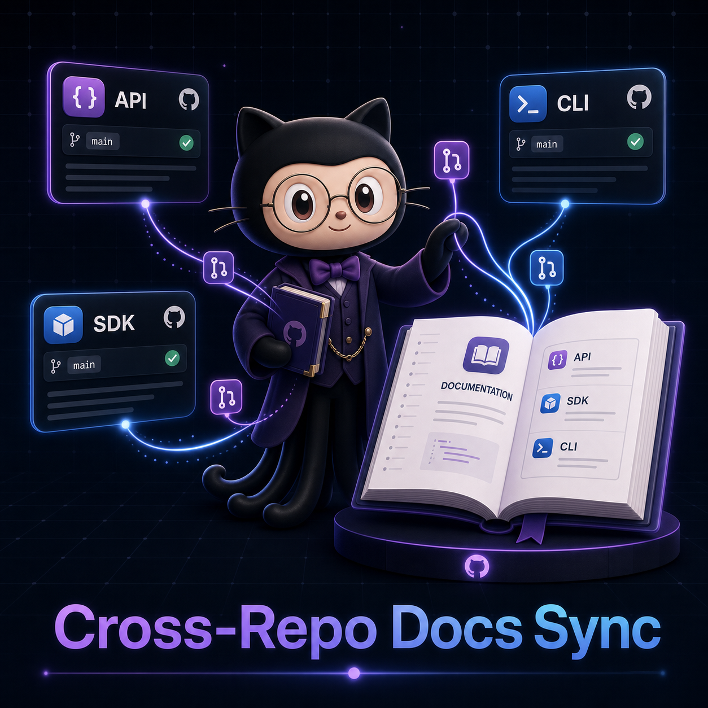

# copilot-cross-repo-docs



## Cross-Repo Documentation Sync with GitHub Agentic Workflows

A CLI tool that watches for merged PRs across multiple repositories and automatically generates documentation pull requests in your docs repo, following the pattern described in [GitHub's Agentic Workflows blog post](https://github.blog/ai-and-ml/github-copilot/automating-cross-repo-documentation-with-github-agentic-workflows/).

## The Problem

When product changes land across multiple repos, documentation falls behind. Teams rely on manual processes to track what changed and update docs accordingly. The gap between code shipping and docs updating grows wider with every sprint.

## What This Does

`cross-repo-docs` monitors a set of source repositories for merged PRs, extracts the semantic changes (new APIs, config options, behavior changes), and opens a documentation PR in your target docs repo with the proposed updates.

```
cross-repo-docs sync \
  --sources "org/api,org/sdk,org/cli" \
  --docs-repo "org/documentation" \
  --since "48h"
```

## How It Works

1. **Scan** — Fetches merged PRs from source repos within the time window
2. **Extract** — Identifies documentation-worthy changes (new exports, changed signatures, added CLI flags, breaking changes)
3. **Generate** — Produces Markdown documentation updates using Copilot's model via the GitHub API
4. **PR** — Opens a pull request in the docs repo with the generated content, linked back to source PRs

## Architecture

```
┌─────────────┐     ┌──────────────┐     ┌─────────────┐     ┌──────────┐
│ Source Repos │────▶│ Change       │────▶│ Doc         │────▶│ Docs PR  │
│ (merged PRs) │     │ Extractor    │     │ Generator   │     │ (target) │
└─────────────┘     └──────────────┘     └─────────────┘     └──────────┘
```

## Installation

```bash
npm install -g copilot-cross-repo-docs
```

Or run directly:

```bash
npx copilot-cross-repo-docs sync --sources "owner/repo1,owner/repo2" --docs-repo "owner/docs"
```

## Configuration

Create `.cross-repo-docs.yml` in your docs repo:

```yaml
sources:
  - repo: org/api
    paths:
      - "src/routes/**"
      - "openapi.yaml"
    doc_section: "api-reference"

  - repo: org/sdk
    paths:
      - "src/public/**"
    doc_section: "sdk"

  - repo: org/cli
    paths:
      - "src/commands/**"
    doc_section: "cli-reference"

generation:
  model: gpt-4.1
  style: "technical, concise, with code examples"
  
review:
  auto_assign: ["docs-team"]
  labels: ["auto-generated", "needs-review"]
```

## Usage

### Basic sync

```bash
cross-repo-docs sync --config .cross-repo-docs.yml
```

### Dry run (preview without creating PRs)

```bash
cross-repo-docs sync --dry-run --since "7d"
```

### Watch mode (run on schedule via GitHub Actions)

```yaml
# .github/workflows/docs-sync.yml
name: Cross-Repo Docs Sync
on:
  schedule:
    - cron: '0 9 * * 1-5'
  workflow_dispatch:

jobs:
  sync:
    runs-on: ubuntu-latest
    steps:
      - uses: actions/checkout@v4
      - run: npx copilot-cross-repo-docs sync --since "24h"
        env:
          GITHUB_TOKEN: ${{ secrets.CROSS_REPO_TOKEN }}
```

## Example Output

When a PR merging a new `/users/{id}/preferences` endpoint lands in `org/api`, this tool generates:

```markdown
## GET /users/{id}/preferences

Returns user preference settings.

**Parameters:**
| Name | Type | Description |
|------|------|-------------|
| id   | string | User identifier |

**Response (200):**
\```json
{
  "theme": "dark",
  "notifications": true,
  "language": "en"
}
\```

*Auto-generated from org/api#347*
```

## Why This Matters

GitHub's agentic workflows are shifting documentation from a manual afterthought to an automated part of the development lifecycle. This tool implements the pattern locally so any team can adopt it without waiting for platform features.

## License

MIT
